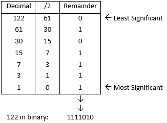

<style>
@import url('https://fonts.googleapis.com/css2?family=Kufam&display=swap');

* {
    font-family: 'Kufam', cursive;
    text-align: center;
}

ul, li {
    text-align: left;
}

h2, h3 {
    text-decoration: underline;
}

li em {
    margin-right: 7px;
}

.chart li {
    margin-bottom: 8px;
}
</style>

<h1>Number Bases</h1>

---

<em>It's the 'language' that a number is written down in.</em>



<h3>Types</h3>

<ul>
<li>Base 2: Binary</li>
<li>Base 8: Octal</li>
<li>Base 10: decimal</li>
<li>Base 16: hexadecimal</li>
<li>Base 64: Base 64</li>
</ul>

<h2>Binary</h2>

<em>Binary digit == "bit"</em>

<p>Computers think in 0s and 1s.</p>
<p>The 0 and 1 represents whether or not a certain circuit has electricity present. This can be interpreted as a number. These numbers are then transported to a 'logic gate' The logic gate then performs arithmetic on the number.</p>

<a href="https://circuitverse.org/">Circuit Simulator</a>

<h3>Prefix in Code</h3>

<ul>
<li>0b: Binary</li>
<li>0x: hexadecimal</li>
<li>0o: Octal</li>
</ul>

```

print(0b11000 == 0x18)
True

```

<h2>Conversions</h2>

<a href="https://cheatography.com/deleted-56036/cheat-sheets/data-representation-aqa-computer-science/">Useful
chart for conversions</a>

<ul class="chart">
<li><em>Denary to Binary:</em> Divide by 2, then read the remainders backwards.</li>
<li><em>Binary to Denary:</em> Multiply the binary numbers (i.e. every single digit) by the relevant place value, then add all of these together.</li>
<li><em>Denary to Hexadecimal:</em>Divide by 16, then read the divisors and remainder backwards. Then convert digits to hex digits.</li>
<li><em>Hexa­dec­imal to Denary:</em>Separate the hex digits, convert each digit to binary, concat­enate, then convert to denary</li>
<li><em>Binary to Hexa­dec­imal:</em>Convert to denary, then hex.</li>
<li><em>Hexa­dec­imal to Binary:</em>Convert to denary, then binary.</li>
</ul>

<h2>Hexadecimal</h2>

```

#ff12d9

```

<p>Colors are a popular form of Hexadecimal</p>
<p>255 is the largest number that can be stored in a single byte</p>

<hr>

<h1>Computing</h1>
<a href="https://en.wikipedia.org/wiki/Turing_completeness">Turing Completeness</a>
<p>
<iframe width="420" height="315" src="https://www.youtube.com/watch?v=RPQD7-AOjMI"></iframe>
</p>
<p>ComputerPhile -- Turing Completeness</p>

<ul>
<li>Operand -- Arguments</li>
<li>A processor register is a quickly accessible location available to a computer's processor. Registers usually consist of a small amount of fast storage, although some registers have specific hardware functions, and may be read-only or write-only. In computer architecture, registers are typically addressed by mechanisms other than main memory, but may in some cases be assigned a memory address e.g. DEC PDP-10, ICT 1900.</li>
<li>In computing, an arithmetic logic unit (ALU) is a combinational digital circuit that performs arithmetic and bitwise operations on integer binary numbers.[1][2][3] This is in contrast to a floating-point unit (FPU), which operates on floating point numbers. It is a fundamental building block of many types of computing circuits, including the central processing unit (CPU) of computers, FPUs, and graphics processing units (GPUs).[4]</li>
</ul>
